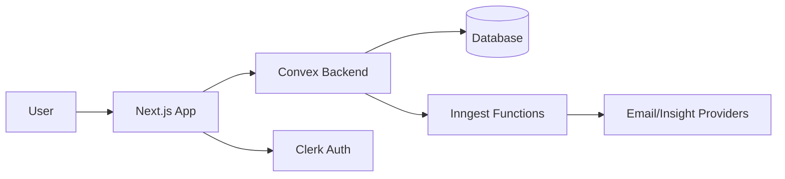

# FairShare

FairShare is a full-stack expense collaboration platform designed to make shared money management simple, transparent, and low-friction.

It solves a common real-world problem: groups track expenses, but settlements become confusing, delayed, and emotionally draining. FairShare turns that into a clear workflow with clean UI, reliable backend logic, and automation where it matters.

---

## 🚀 Project Overview

FairShare helps friends, teams, and households:

- Track shared expenses
- Understand who owes whom, in real time
- Settle dues with confidence
- Stay informed via automated reminders and insights

The product is built with a user-first mindset: reduce ambiguity, reduce manual work, and reduce social friction around money.

---

## 🎯 Motivation

Most split-expense apps stop at data entry. Users still struggle with:

- Unclear net balances across multiple people
- Delayed follow-ups for pending settlements
- Missing context around spending behavior
- Clunky flows that are hard to trust on mobile

FairShare is built to close that gap.

The goal is not just to "record expenses" but to help users reach closure: everyone knows the state of the group, what action is needed next, and why.

---

## 🧠 System Thinking

I approached this as both a product and systems problem.

- Product lens: Every screen answers a concrete user question, such as "What do I owe right now?" or "What should I settle first?"
- Systems lens: Domain logic is centralized and deterministic so balance calculations remain consistent across views.
- Reliability lens: Async workflows (emails, recurring jobs, insights) are decoupled from user-facing interactions to keep UX fast.
- Maintainability lens: Clear module boundaries, reusable UI primitives, and service-oriented backend functions make iteration safer.

---

## 🏗️ Architecture

FairShare follows a modern full-stack architecture with a clear separation of concerns:

- Presentation Layer: Next.js App Router UI with responsive, component-driven screens.
- Domain + Data Layer: Convex functions for queries, mutations, and schema-backed data access.
- Orchestration Layer: Inngest for scheduled and event-driven background workflows.
- Integration Layer: Resend (email), AI model providers (for insights), and optional payment gateway integrations.
- Delivery Layer: Vercel-hosted frontend/API edge with production environment management.



---

## ⚙️ Tech Stack (and Why)

- Next.js (App Router): Enables fast iteration with server/client composition, clean routing, and production-grade deployment ergonomics.
- React + modern JavaScript: Component-driven UI with predictable state and reusable interaction patterns.
- Convex: Real-time-friendly backend API model with strong developer velocity for data-driven apps.
- Inngest: Reliable event and cron orchestration for workflows that should not block user actions.
- Clerk: Managed authentication for secure identity handling and reduced auth surface area.
- Vercel: Optimized deployment path for Next.js with fast previews and production rollouts.
- Resend + AI integrations: Practical capabilities for reminders and personalized spending insights.

---

## 🔄 Event-Driven Design (Inngest)

FairShare uses Inngest to move background concerns out of request/response paths.

Current workflow patterns include:

- Scheduled payment reminders for users with outstanding balances
- Monthly spending insight generation and email delivery
- Retry-friendly execution for external integrations

Why this matters:

- Improves UX responsiveness by keeping user actions non-blocking
- Increases reliability with retriable, observable background jobs
- Creates a scalable path for future workflows (nudges, alerts, anomaly checks)

---

## 🎨 UI/UX Philosophy

FairShare prioritizes clarity over visual noise.

- Information hierarchy first: users see net outcome before raw details.
- Progressive complexity: simple summaries first, deeper context on demand.
- Mobile-first responsiveness: settlement and expense flows remain usable on small screens.
- Action-oriented design: each page makes the next best action obvious.

UI polish is treated as a product feature, not decoration. If users cannot confidently act, the system has not solved the problem.

---

## 📦 Product Capabilities

- Group and individual balance tracking with clear net positions
- Expense creation with participant-aware splitting and categories
- Settlement recording to reduce outstanding dues
- Contact and group management for collaborative use cases
- Dashboard summaries for at-a-glance financial state
- Automated reminders for pending payments
- AI-assisted monthly spending insights for behavioral visibility

---

## 🧪 Reliability and Edge Cases

FairShare is built with defensive handling for real-world input and async failures.

- Validation of settlement amount and actor direction before writes
- Authentication checks before user-scoped queries/mutations
- Graceful UI states for loading and missing data
- Error feedback surfaced to users without leaking internal details
- Background task isolation for external provider failures
- Retry-oriented workflow execution in Inngest

---

## 🌍 Scalability Considerations

The architecture supports growth in both usage and product complexity.

- Event-driven workflow model avoids coupling heavy jobs to interactive routes
- Data access is organized around use-case specific backend functions
- Real-time-capable backend patterns reduce ad-hoc synchronization complexity
- Modular component architecture allows UI scaling without monolith sprawl
- Deploy-preview workflow enables safe incremental releases

---

## 🔐 Security Considerations

Security is treated as baseline engineering hygiene.

- Clerk-based authentication with token-backed user identity checks
- Server-side authorization in backend functions for protected operations
- Environment-variable based secret management
- Separation between public keys and server-only credentials
- Minimal trust in client input; server-side validation for writes

Recommended production practices:

- Rotate exposed keys immediately if leaked
- Keep auth issuer and provider settings strictly aligned across environments
- Add audit logging for sensitive money-state mutations

---

## 🚀 Deployment and Production Mindset

FairShare is deployed on Vercel with an operations-first workflow.

- Use preview deployments for safe review before production
- Keep environment configuration explicit per environment
- Wire Inngest app sync to deployed serve endpoints
- Monitor analytics and runtime behavior after each release

Production checklist:

- Verify auth configuration parity (local vs production)
- Verify background job sync and webhook reachability
- Verify all external integrations via smoke tests
- Verify critical user journeys on mobile and desktop

---

## 🛠️ Local Development

### Prerequisites

- Node.js 20+
- npm
- Configured environment variables for Convex, Clerk, and integrations

### Run the app

```bash
npm install
npm run dev
```

Open http://localhost:3000

### Run supporting services

- Convex backend (development deployment)
- Inngest dev server when testing workflows locally

---

## 🤝 Contributing

Contributions are welcome and appreciated.

If you are contributing:

- Open an issue describing the problem and proposed approach
- Keep pull requests focused and reviewable
- Include reasoning for architectural changes and trade-offs
- Add tests or validation notes for critical logic paths
- Preserve UX consistency and accessibility in UI changes

Contribution quality bar:

- Clear intent
- Minimal complexity
- Production-safe defaults

---

## 📈 Future Improvements

- End-to-end payment gateway settlement flow with server-side verification
- Better dispute handling for expense edits and settlement reversals
- Advanced observability dashboard for async workflow health
- Multi-currency and localization support
- Smarter recommendation engine for proactive debt minimization
- Role-based controls for larger teams/households

---

## 🧑‍💻 About the Developer

I built FairShare with the mindset of an engineer who owns outcomes, not just code.

- I care about product clarity as much as technical correctness.
- I design systems to be understandable, resilient, and maintainable.
- I prioritize UX confidence, backend reliability, and clean execution in production.

If you are evaluating this project for SDE/full-stack roles, FairShare reflects how I think: user-first, architecture-aware, and delivery-focused.

---

## License

This project is available under the MIT License unless stated otherwise.